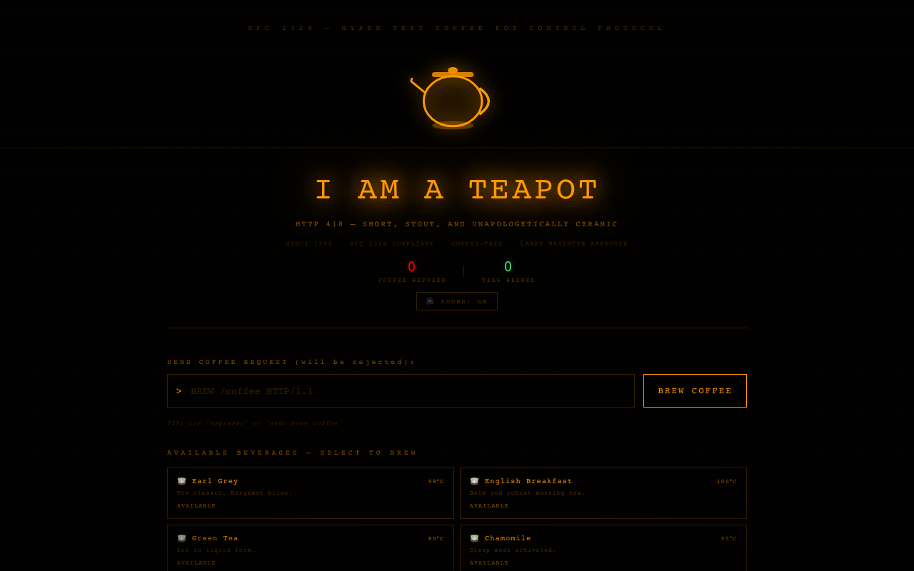

# :tea: HTTP 418 — I'm a Teapot

**The ultimate HTTP 418 "I'm a teapot" experience — brew tea, refuse coffee, honor RFC 2324.**

Built by [Arnold Wender](https://arnoldwender.com)

[:rocket: Live Demo](https://http-418-teapot.netlify.app)



## Features

- Animated SVG teapot with pouring animations
- Full HTTP status code tea menu — each status has its own blend
- Interactive brew timer with steam effects
- Thermal receipt generator for your tea orders
- Teapot customizer — colors, patterns, and accessories
- 10 unlockable achievements for dedicated tea enthusiasts
- Sound effects for brewing, pouring, and sipping
- Confetti celebrations when you unlock achievements
- Coffee requests are firmly and politely refused (as per RFC 2324)

## Tech Stack

- **React 18** + **TypeScript**
- **Vite** — lightning-fast dev server and builds
- **Tailwind CSS** — utility-first styling
- **Framer Motion** — smooth animations and transitions
- **canvas-confetti** — celebration effects
- **html2canvas** — thermal receipt generation
- **Lucide React** — icon set
- **Web Audio API** — sound effects

## Getting Started

```bash
# Clone the repository
git clone https://github.com/arnoldwender/http-418-teapot.git
cd http-418-teapot

# Install dependencies
npm install

# Start development server
npm run dev
```

Open [http://localhost:5173](http://localhost:5173) in your browser.

## Build

```bash
npm run build
npm run preview
```

## License

MIT
